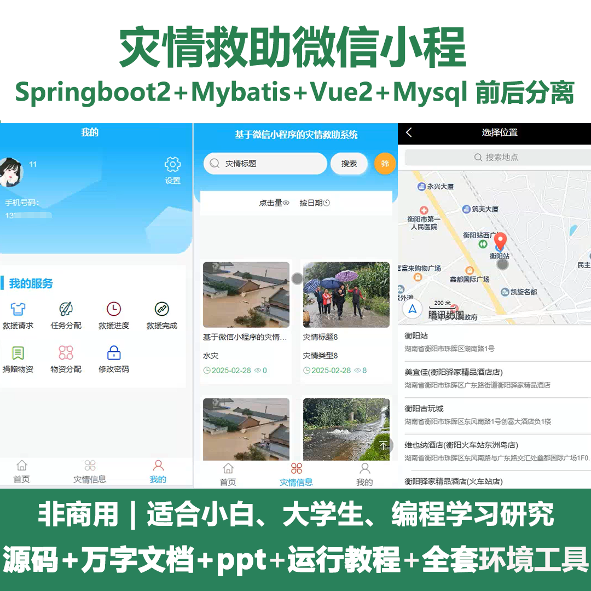
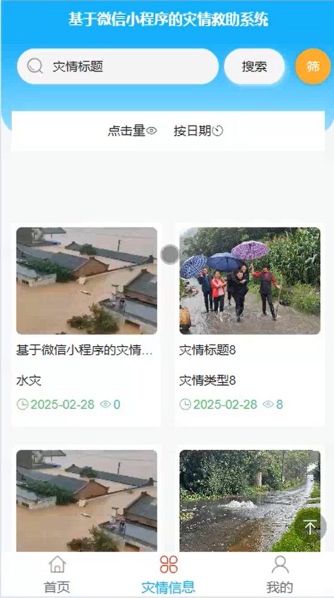
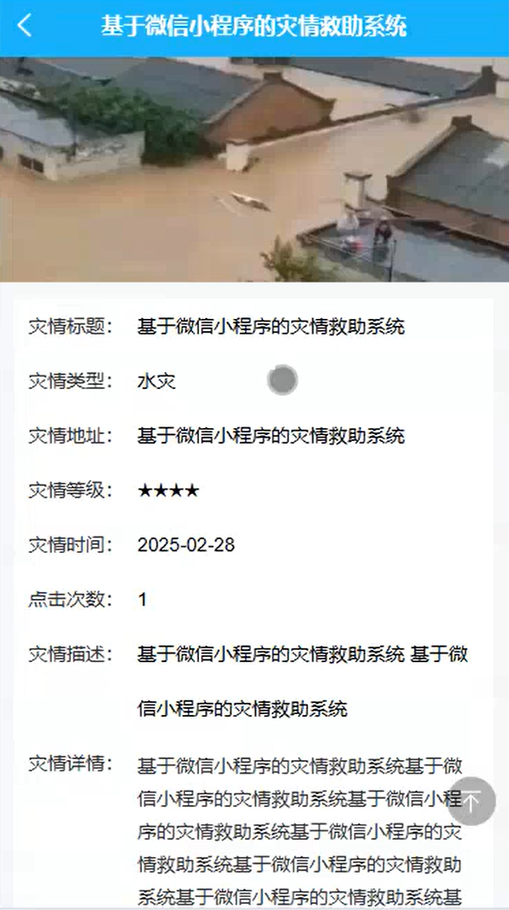
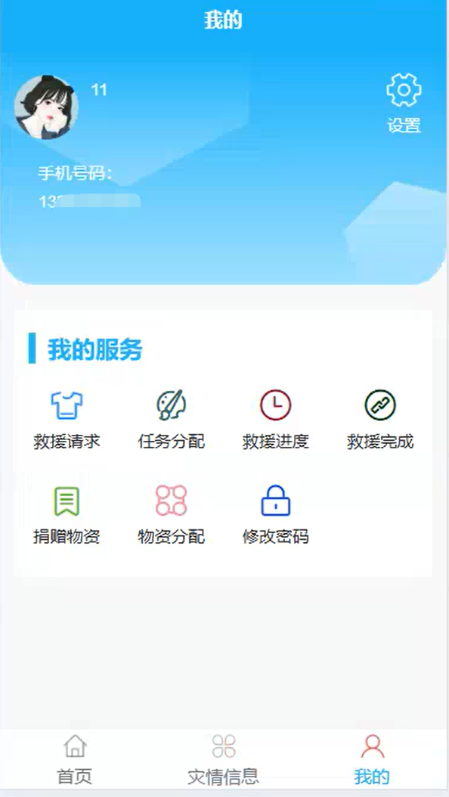
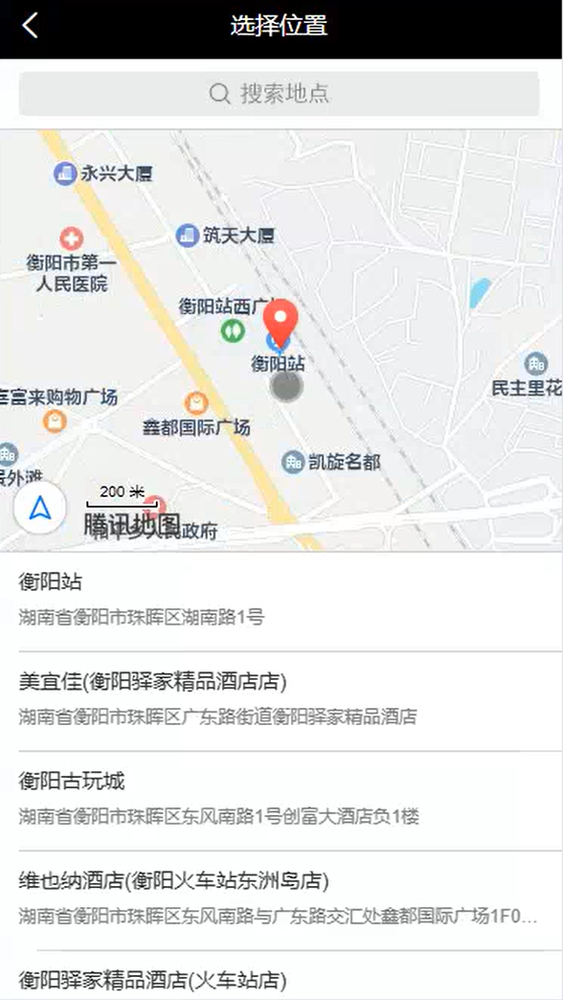
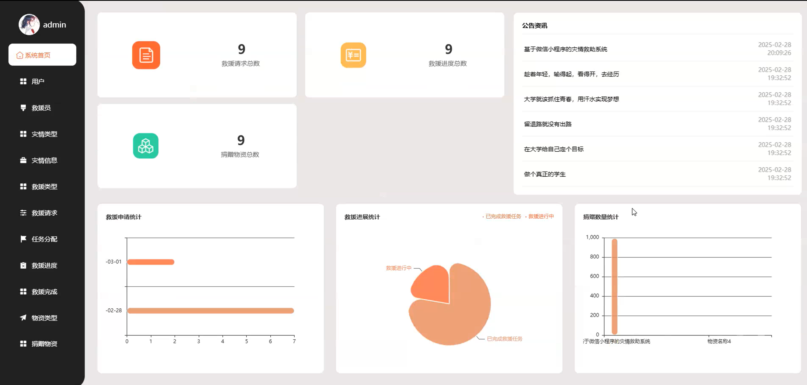
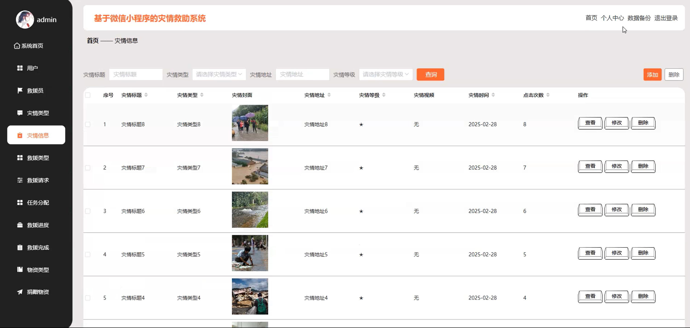
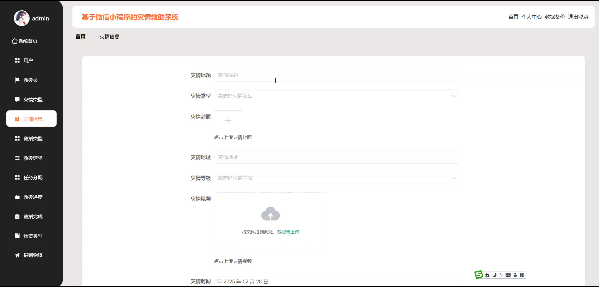
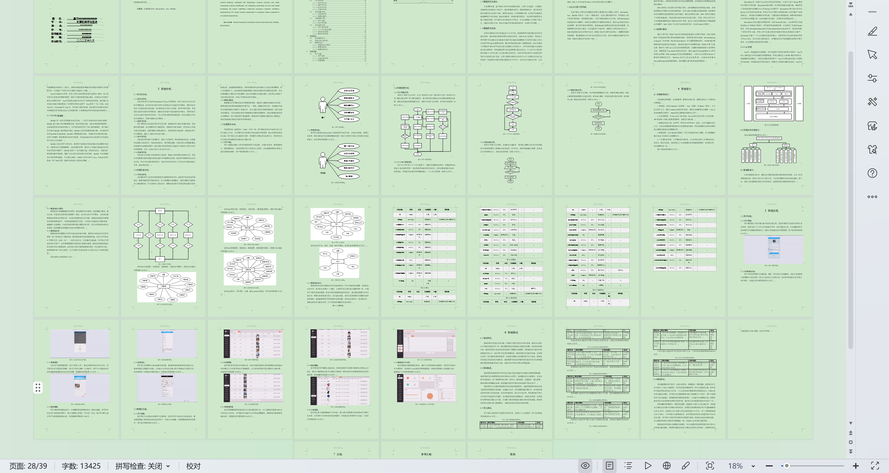

# mpweixinA219D
mpweixinA219D灾情救助微信小程序+LW+PPT
 
## 源码问题查看主页咨询

### 一、关键词
灾情信息，救援请求，捐赠物资

### 二、作品包含
源码+数据库+万字设计文档+PPT+全套环境和工具资源+本地部署教程

### 三、项目技术
前端技术： Html、Css、Js、Vue2.0、Element-ui、uniapp
后端技术：Java、SpringBoot2.0、MyBatis

### 四、运行环境（以下版本亲测，其他版本兼容性请自行测试）
开发工具：IDEA/eclipse  + VSCODE + 微信开发者工具 + HBuilder X

数据库：MySQL5.7（最低要5.7版本）

数据库管理工具：Navicat10以上版本

环境配置软件： JDK1.8 + Maven3.6.3

前端Nodejs：14

浏览器：谷歌浏览器

### 五、项目介绍
项目编号：mpweixinA219D

灾情救助微信小程序，帮助社会应急力量和各级管理部门高效开展救助工作。

角色：管理员、用户、救援员

管理员：系统首页、用户、救援员、灾情类型、灾情信息、救援类型、救援请求、任务分配、救援进度、救援完成、物资类型、捐赠物资、物资分配、系统管理、个人中心。

用户：首页、灾情信息、我的、救援请求、任务分配、救援进度、救援完成、捐赠物资、物资分配、修改密码。

救援员：首页、灾情信息、我的、任务分配、救援进度、救援完成、修改密码。

### 六、运行截图

